# CAU LaTeX Templates

Version: 1.0 (2026-07-07)

`cau-latex-templates` is a LaTeX template bundle for Christian-Albrechts-Universität zu Kiel (CAU) thesis and presentation formats. It provides a reusable thesis document class, a reusable Beamer presentation style, full working example projects, compact installable examples, documentation, and release ZIP packages for local use or Overleaf.

The project is designed for students, researchers, and editors who want to start from a complete example, replace the metadata/content, and compile a polished CAU-style PDF with `latexmk`.

## Open in Overleaf

The buttons below open the release ZIP packages directly in Overleaf. The ZIP files are hosted via GitHub Pages so Overleaf can fetch them without GitHub release redirects or login state.

| Template | Open in Overleaf | ZIP Download |
|---|---|---|
| CAU Thesis | [](https://www.overleaf.com/docs?snip_uri=https%3A%2F%2Froberthennings.github.io%2FLatex_Templates%2Fdownloads%2Fcau-thesis.zip&engine=xelatex&main_document=cau-thesis%2Fmain.tex) | [cau-thesis.zip](https://roberthennings.github.io/Latex_Templates/downloads/cau-thesis.zip) |
| CAU Presentation | [](https://www.overleaf.com/docs?snip_uri=https%3A%2F%2Froberthennings.github.io%2FLatex_Templates%2Fdownloads%2Fcau-presentation.zip&engine=xelatex&main_document=cau-presentation%2Fmain.tex) | [cau-presentation.zip](https://roberthennings.github.io/Latex_Templates/downloads/cau-presentation.zip) |
| All Templates | [](https://www.overleaf.com/docs?snip_uri=https%3A%2F%2Froberthennings.github.io%2FLatex_Templates%2Fdownloads%2Fcau-latex-templates.zip&engine=xelatex&main_document=cau-latex-templates%2Fcau_thesis%2Fmain.tex) | [cau-latex-templates.zip](https://roberthennings.github.io/Latex_Templates/downloads/cau-latex-templates.zip) |

## Example Previews

Each preview image links to the corresponding generated PDF in `examples/`. The CI workflow creates root-level `examples/*.pdf` files for these preview links, mirrors the PDFs into categorized `examples/` subfolders, and stores first-page PNG screenshots in the top-level `previews/` folder.

| CAU Thesis | CAU Presentation |
|---|---|
| [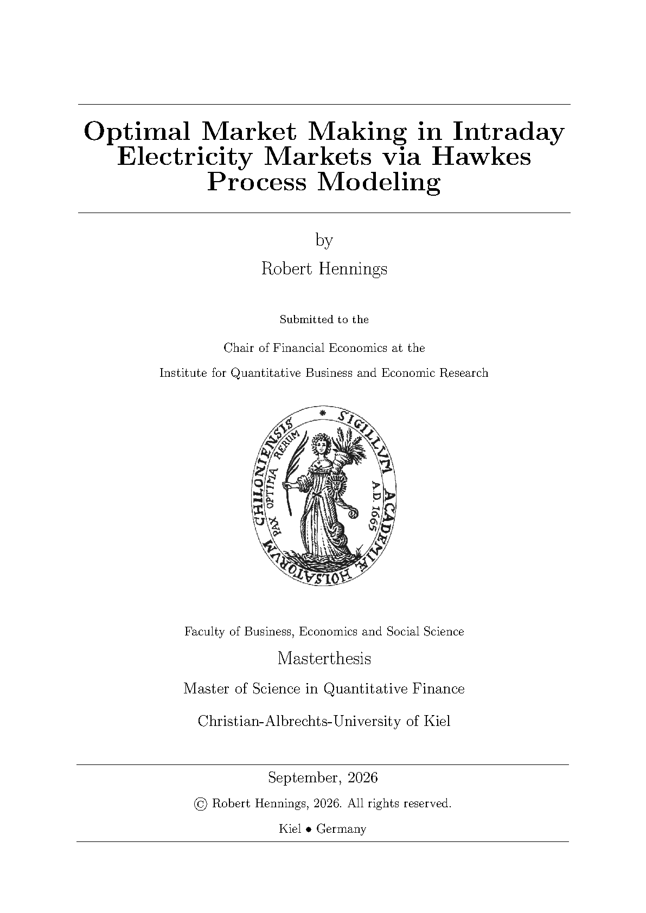](examples/cau-thesis-main.pdf) | [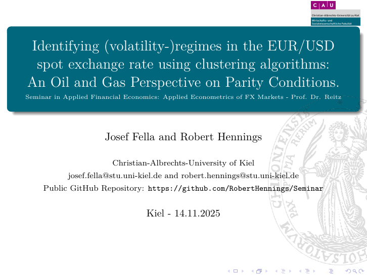](examples/cau-presentation-main.pdf) |
| [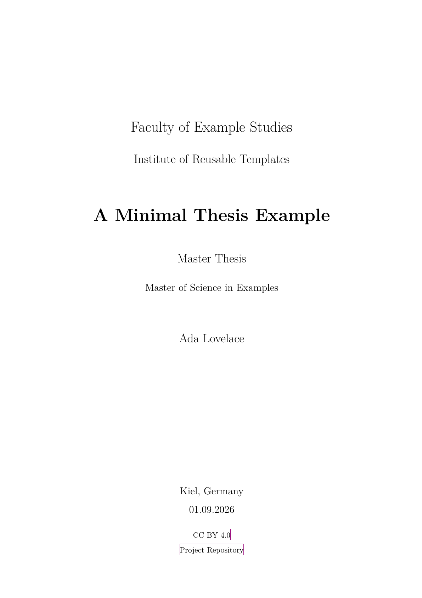](examples/cau-thesis-example.pdf) | [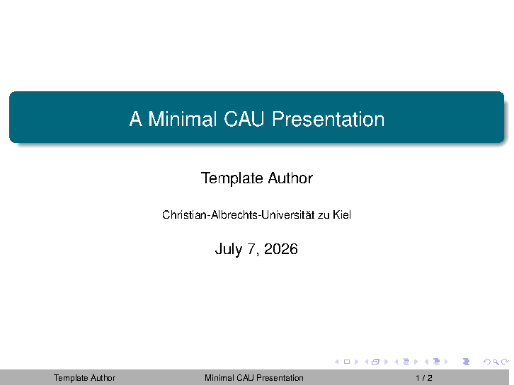](examples/cau-presentation-example.pdf) |

| Title Page | Hard-Cover Title Page |
|---|---|
| [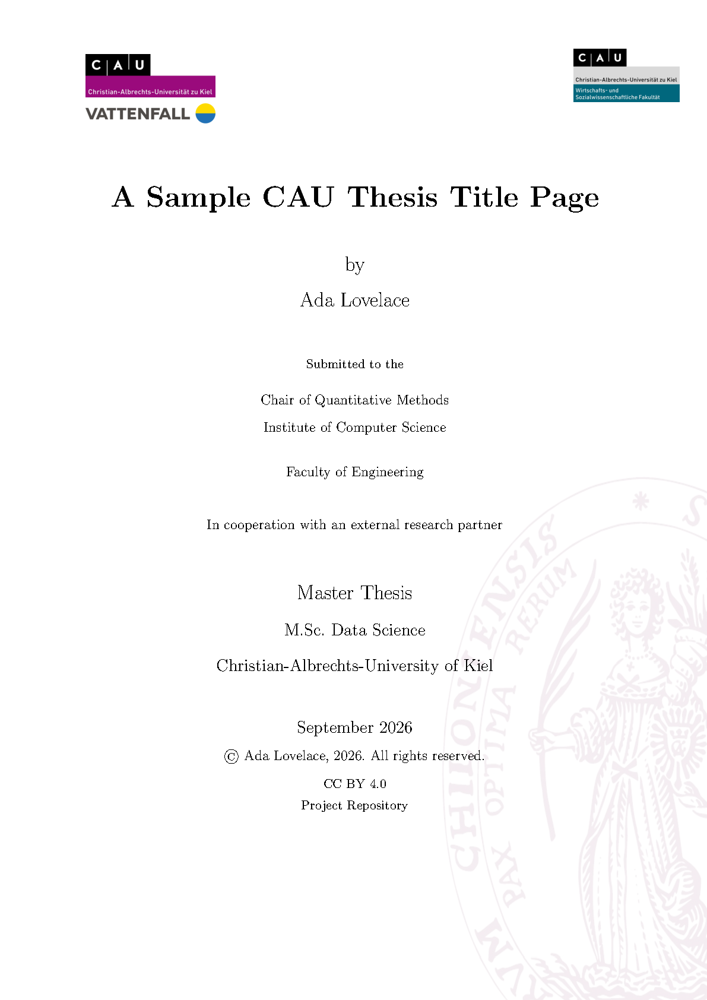](examples/titlepage-sample.pdf) | [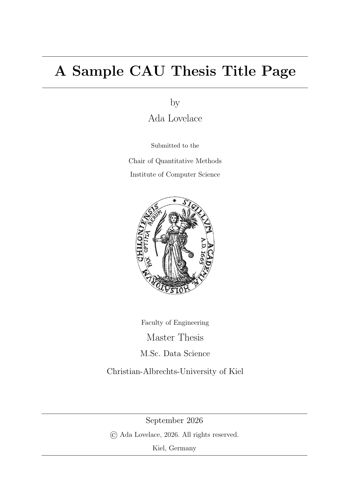](examples/hard-cover-titlepage-sample.pdf) |

| Alternative Title Page | Math Title Page |
|---|---|
| [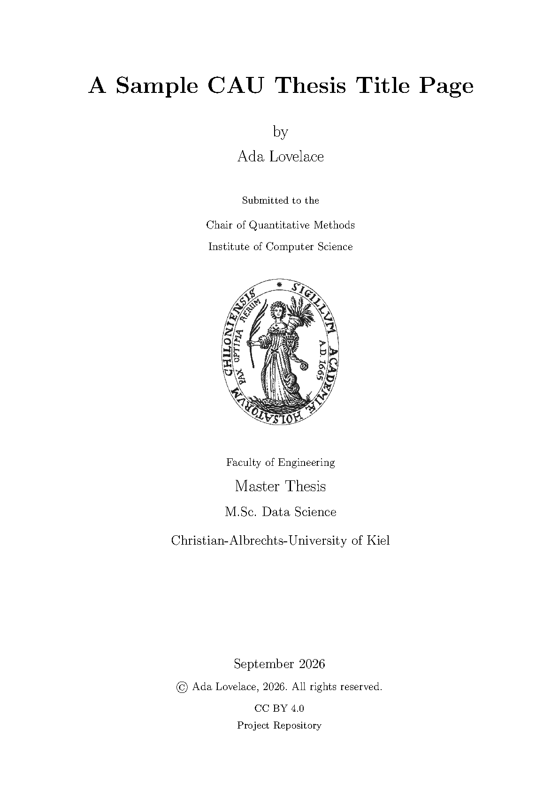](examples/titlepage-alt-sample.pdf) | [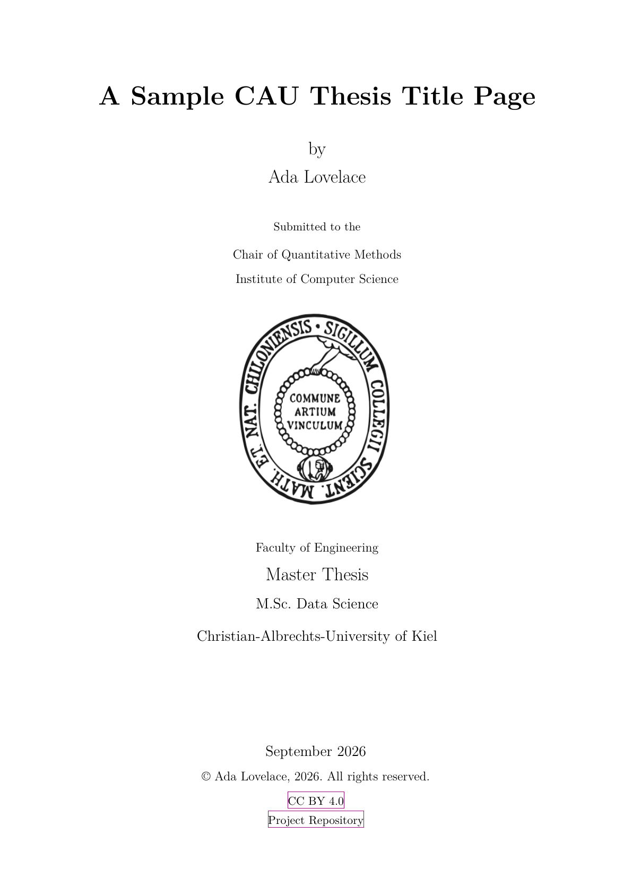](examples/titlepage-alt-math-sample.pdf) |

| Submission Title Page | Thesis Documentation |
|---|---|
| [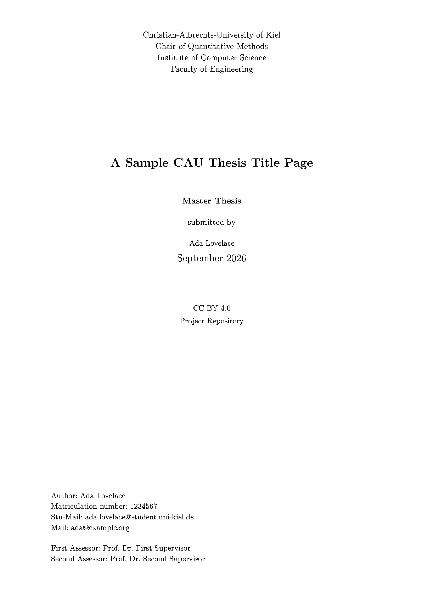](examples/titlepage-submission-sample.pdf) | [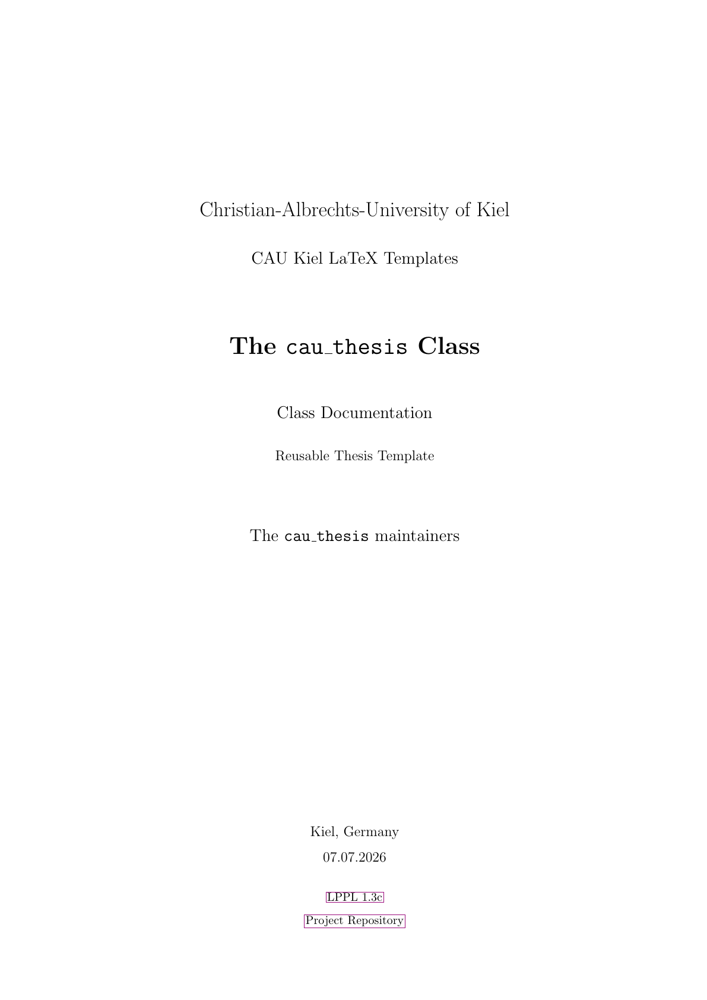](examples/cau-thesis-doc.pdf) |

| Classic Design Example | Minimal Design Example |
|---|---|
| [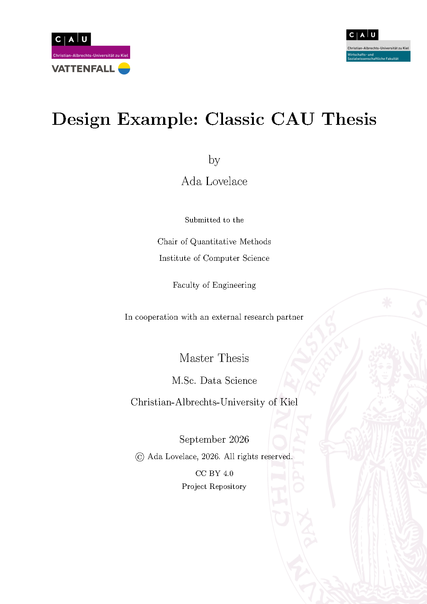](examples/design-example-classic.pdf) | [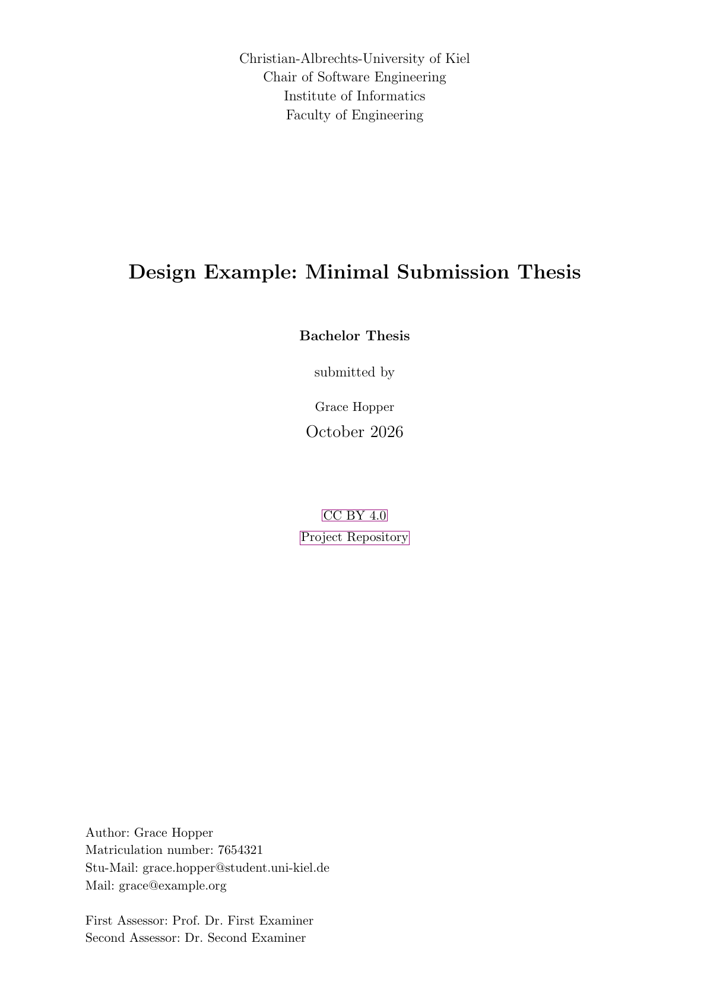](examples/design-example-minimal.pdf) |

## What Is Included

This repository ships two independent but related LaTeX templates:

- `cau_thesis/` contains the `cau_thesis` document class and a thesis project skeleton.
- `cau_presentation/` contains the `cau_presentation` Beamer style and a presentation project skeleton.

Both projects are intentionally self-contained. Build each project from inside its own folder so relative paths for chapters, figures, logos, bibliography files, and title pages resolve predictably.

## What Is Included in Detail

### Publication Classes and Styles

- `cau_thesis/cau_thesis.cls` — reusable CAU thesis class, loaded with `\documentclass{cau_thesis}`.
- `cau_presentation/cau_presentation.sty` — reusable CAU Beamer style, loaded with `\usepackage{cau_presentation}`.

### Full Example Projects

These folders are the best starting point for editing a real document. They include template entry points, metadata examples, chapter/slide section files, bibliography files, figures, logos, title pages, and generated PDFs where available.

- `cau_thesis/` — full CAU thesis example and thesis class package.
- `cau_presentation/` — full CAU Beamer presentation example and presentation style package.

The thesis folder uses `main.tex` as its full editable document. The presentation folder also uses `main.tex` and reads slide content from `chapters/`.

### Compact Installable Examples

- `cau_thesis/examples/thesis-example.tex`
- `cau_presentation/examples/presentation-example.tex`
- `examples/cover_page_samples/latex_sources/titlepage_sample.tex`
- `examples/cover_page_samples/latex_sources/hard_cover_titlepage_sample.tex`
- `examples/cover_page_samples/latex_sources/titlepage_alt_sample.tex`
- `examples/cover_page_samples/latex_sources/titlepage_alt_math_sample.tex`
- `examples/cover_page_samples/latex_sources/titlepage_submission_sample.tex`
- `examples/design_examples/latex_sources/design_example_classic.tex`
- `examples/design_examples/latex_sources/design_example_minimal.tex`

These are smaller examples for checking reusable class/style behavior, title-page variants, and design variants. Some root-level examples reference `cau_thesis/` through relative paths so they can be compiled directly from this repository without system-wide installation.

### Documentation and Packaging

- `doc/cau-thesis-doc.tex` — thesis class manual source.
- `doc/cau-thesis-doc.pdf` — built thesis class manual.
- `cau_thesis/README.md` — thesis-specific usage notes and command reference.
- `cau_presentation/README.md` — presentation-specific usage notes and package options.
- `INSTALL.md` — installation and local build notes.
- `PACKAGING.md` — packaging notes.
- `CONTRIBUTING.md` — contribution notes and issue categories.
- `CHANGELOG.md` — release history.
- `.github/workflows/latex-ci.yml` — CI build, release ZIP, GitHub Pages, and GitHub Release workflow.
- `latexmkrc` — shared build configuration for XeLaTeX, `biber`, and cleanup rules.

## Requirements

Use a Unicode/OpenType capable LaTeX engine for the repository builds:

- `xelatex` is configured by `latexmkrc` and used by the release workflow through `latexmk`.
- `lualatex` may work for many documents, but it is not the default build path here.
- `biber` is required for documents that use the bundled `biblatex` bibliographies.
- `latexmk` is recommended because it automatically repeats LaTeX and bibliography passes.

The templates use standard TeX Live/MiKTeX packages including `babel`, `biblatex`, `beamer`, `xcolor`, `graphicx`, `hyperref`, `hyperxmp`, `tikz`, `amsmath`, `amsthm`, `titlesec`, `caption`, `csquotes`, `algorithm`, `algpseudocode`, `booktabs`, `tabularx`, and related dependencies.

## Quick Start: Build a Full Example

The easiest way to get started is to compile one of the full example projects.

```sh
cd cau_thesis
latexmk -xelatex main.tex
```

For the presentation example:

```sh
cd cau_presentation
latexmk -xelatex main.tex
```

The repository includes `latexmkrc`, which sets XeLaTeX mode, uses `biber`, and cleans common auxiliary files.

## Quick Start: Edit a Thesis

For most thesis users, start with `cau_thesis/main.tex` and edit the metadata block, chapter inputs, bibliography, figures, tables, and title-page choice.

### 1. Set Thesis Metadata

The main thesis metadata fields are set in the preamble:

```tex
\title{A thesis title}
\author{Author Name}
\thesisauthor{Author Name}
\submissiondate{01.09.2026}
\faculty{Faculty Name}
\institute{Institute Name}
\typedocument{Master Thesis}
\programme{M.Sc. Programme}
\location{Kiel, Germany}
\license{CC BY 4.0}{https://creativecommons.org/licenses/by/4.0/}
\githubrepo{Project Repository}{https://example.org/repository}
```

Additional student and supervisor helpers include:

```tex
\stunumber{123456}
\stuemail{name@stu.uni-kiel.de}
\privatemail{name@example.org}
\firstsupervisorname{First Supervisor}
\secondsupervisorname{Second Supervisor}
```

### 2. Choose a Title Page

The full thesis template uses title-page wrappers from `cau_thesis/title_pages/`. Pick the variant that matches the submission type and keep the path relative to `cau_thesis/main.tex`:

```tex
\input{title_pages/titlepage}
\input{title_pages/titlepage_alt}
\input{title_pages/titlepage_alt_math}
\input{title_pages/titlepage_submission}
\input{title_pages/hard_cover_titlepage}
```

For a generic title page that does not depend on project-specific title-page files, use:

```tex
\makethesistitlepage
```

### 3. Add Chapters and Bibliography

The full thesis skeleton keeps content in `cau_thesis/chapters/` and bibliography data in `cau_thesis/bibliography.bib`:

```tex
\addbibresource{bibliography.bib}
\input{chapters/01-introduction}
\input{chapters/02-literature-review}
\input{chapters/09-references}
```

The class loads `biblatex` with the `biber` backend. Use `latexmk -xelatex main.tex` so bibliography passes are handled automatically.

## Quick Start: Edit a Presentation

For most presentation users, start with `cau_presentation/main.tex` and edit the title metadata, author list, color settings, chapter inputs, figures, data, and bibliography.

### 1. Load the Style

Use the CAU presentation package from a Beamer document:

```tex
\documentclass{beamer}
\usepackage{cau_presentation}
```

The package supports configurable theme and color options:

```tex
\usepackage[
  theme=Madrid,
  innertheme=circles,
  maincolor=9b0a7d,
  accentcolor=00677c,
  neutralcolor=B0B0B0,
  hidelinks=true,
  numberedcaptions=true
]{cau_presentation}
```

### 2. Set Authors and Title Metadata

The full presentation template demonstrates CAU-specific author helpers and standard Beamer metadata:

```tex
\cau_author{Author Name}{author@stu.uni-kiel.de}
\github{Public GitHub Repository: }{https://example.org/repository}
\title[Short Title]{Full Presentation Title}
\subtitle{Presentation subtitle}
\author[\cauauthornames]{\cauauthornames}
\institute[CAU]{Christian-Albrechts-Universität zu Kiel}
\date[\today]{\today}
```

### 3. Add Slides, Figures, and References

Keep slide sections in `cau_presentation/chapters/`, figures in `cau_presentation/figures/`, and bibliography data in `cau_presentation/references.bib`:

```tex
\addbibresource{references.bib}
\input{titlepage}
\caupresentationtableofcontents
\section{Section Title}
\input{chapters/chapter-00}
```

Useful figure/table helpers include:

```tex
\caupresentationlistfigure{<label>}{<caption text>}
\caupresentationlisttable{<label>}{<caption text>}
\caupresentationclickablefigure[<graphics options>]{<file>}{<caption>}{<url>}
```

## Full Example Folder Anatomy

A typical full template folder contains:

- `main.tex` — main editable document.
- `chapters/` — modular thesis chapters or presentation slide sections.
- `bibliography.bib` or `references.bib` — bibliography database.
- `figures/`, `logos/`, `tables/`, or `data/` — source assets referenced by the template.
- `title_pages/` or `titlepage.tex` — title-page/title-frame building blocks.
- `examples/` — compact smoke-test examples.
- local `.cls` or `.sty` files — reusable template implementation.

When writing a new thesis or presentation, copy the relevant full example folder and replace the metadata, content files, figures, bibliography, and body text.

## Build Compact Examples

Compile compact thesis and presentation examples from their project folders:

```sh
cd cau_thesis
latexmk -xelatex examples/thesis-example.tex

cd ../cau_presentation
latexmk -xelatex examples/presentation-example.tex
```

Compile root-level title-page and design examples from their source folders:

```sh
cd examples/cover_page_samples/latex_sources
latexmk -xelatex titlepage_sample.tex
latexmk -xelatex hard_cover_titlepage_sample.tex
latexmk -xelatex titlepage_alt_sample.tex
latexmk -xelatex titlepage_alt_math_sample.tex
latexmk -xelatex titlepage_submission_sample.tex

cd ../../design_examples/latex_sources
latexmk -xelatex design_example_classic.tex
latexmk -xelatex design_example_minimal.tex
```

If an example uses a bibliography, run `biber` between LaTeX passes or use `latexmk`.

## Fonts and Assets

The templates use CAU/Kiel branding assets where available and otherwise rely on standard TeX fonts and packages.

Current behavior:

- Thesis graphics are searched through relative `figures/`, `logos/`, and `tables/` paths configured by `cau_thesis.cls`.
- Presentation graphics are searched from the presentation folder and its configured figure/data paths.
- Logos, example figures, spreadsheets, PDFs, and other non-source assets may have separate redistribution restrictions.
- Before public redistribution or CTAN upload, review all non-source assets and exclude anything with unclear redistribution terms.

## Local Installation

For everyday editing inside this repository, no system-wide installation is required: compile from the relevant full example folder.

For local TeX installation of the reusable files, copy the class/style files into a local texmf tree, then refresh the filename database if needed:

```sh
mkdir -p ~/texmf/tex/latex/cau-latex-templates
cp cau_thesis/cau_thesis.cls ~/texmf/tex/latex/cau-latex-templates/
cp cau_presentation/cau_presentation.sty ~/texmf/tex/latex/cau-latex-templates/
mktexlsr ~/texmf
```

If you install only the reusable files, keep any required logos, figures, title pages, and bibliography files next to your document or update paths accordingly.

See `INSTALL.md` for additional installation notes.

## Documentation

The thesis manual source and built PDF live in `doc/`.

Rebuild the manual from the repository root with:

```sh
latexmk -cd -xelatex doc/cau-thesis-doc.tex
```

Generated auxiliary files such as `.aux`, `.bcf`, `.log`, `.out`, `.toc`, `.xdv`, `.fls`, `.fdb_latexmk`, `.run.xml`, `.nav`, `.snm`, and `.vrb` should not be included in final release archives.

## Release Preparation

Release ZIP packages are assembled by `.github/workflows/latex-ci.yml` and published for Overleaf through GitHub Pages when the matching release workflow runs.

The release packages are:

- `cau-thesis.zip` — thesis folder plus shared documentation files and built PDFs.
- `cau-presentation.zip` — presentation folder plus shared documentation files and built PDFs.
- `cau-latex-templates.zip` — combined thesis and presentation bundle plus shared documentation files.

Before a public release, confirm redistribution rights for all included logos, images, spreadsheets, PDFs, and other non-source assets.

For packaging details, see `PACKAGING.md`.

## Troubleshooting

### `pdflatex` Fails or Uses the Wrong Engine

Use `latexmk` from this repository so `latexmkrc` selects XeLaTeX:

```sh
latexmk -xelatex main.tex
```

If you build manually, run `xelatex` instead of `pdflatex`.

### Bibliography Does Not Update

Run `biber`, or let `latexmk` do it:

```sh
latexmk -xelatex main.tex
```

For a manual build:

```sh
xelatex main.tex
biber main
xelatex main.tex
xelatex main.tex
```

### Class or Style File Not Found

Compile from the relevant full example folder, which contains the local class/style file, or install `cau_thesis.cls` and `cau_presentation.sty` into a TeX-searchable location.

### Images Not Found

Compile from the template folder that contains the referenced `figures/`, `logos/`, `tables/`, `data/`, and title-page files. If you move the main `.tex` file, update image paths accordingly.

### Stale Build Files Cause Errors

Clean generated files and rebuild:

```sh
latexmk -C main.tex
latexmk -xelatex main.tex
```

## License and Maintainers

- **Package name:** `cau-latex-templates`
- **License:** Intended for LPPL 1.3c or later for reusable LaTeX source files; bundled third-party assets retain their own licenses.
- **Maintainer:** Robert Hennings.

## Authors

### Technical Implementation

$© \textit{Robert Hennings}$
